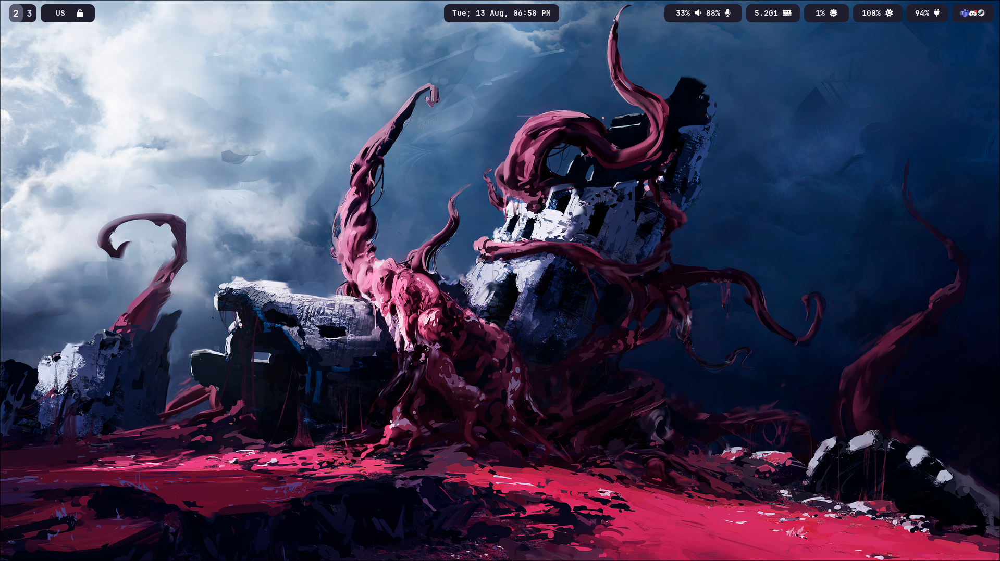

# ❄️ My NixOS Config

```bash
git clone https://github.com/ealtun21/nix
mv nix $HOME/nix # Config is supposed to be in the ~/nix directory
cp /etc/nixos/hardware-configuration.nix $HOME/nix/nixos/hardware-configuration.nix
sudo nixos-rebuild switch --flake $HOME/nix
home-manager switch --flake $HOME/nix
```
Enjoy!


